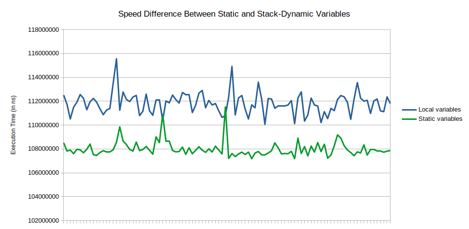

## Speed Racer

Sebesta opines that one of pros of using static local variables is that they offer a speed improvement over stack-dynamic local variables (p. 208). He reasons that access to those variables is faster because their addresses can be calculated directly rather than indirectly. Before we can judge whether or not his claim is accurate, we need to find out *why* stack-dynamic local variables need to be accessed indirectly.

### Stack Frames and Indirect Access to Local Variables

As you have learned in this class, when a function is executed a new instance of a special control structure is *pushed* on to the *stack*. Hence the name! That control structure is variously called the activation record or (what I prefer) the stack frame. To accommodate recursion, local variables to a function must be placed on the stack. Make sure that you can explain why (Hint: You *will* see this on the midterm). 

Let's say that we are executing the following C++ function:

```C++
int recursive(int a) {
  int b{0};
  ...
  b = do_calculation(a);
  return a + recursive(b)
}
```

In order to access (for reading or writing) the variable `b`, it is vital that the function access the `b` for *this* instance of the recursive function. Not some *other* instance. By what mechanism can we ensure that happens?

Consider what is available to the function at runtime:
1. A pointer to the base of the stack frame for this instance of the function (remember that is an invariant throughout function invocation).
2. The address of the currently executing machine instruction in memory (remember that from Computer Systems class).
3. The number and type of local variables.
4. Knowledge of how the compiler has placed those local variables in the stack frame.

And that's it!! In order to calculate the address of a function-local variable (again, for reading or writing), the compiler has *no choice* but to generate code that calculates the address of the variable with respect to the only thing that it knows concretely -- the address of the base of the stack frame!

In pseudocode, the calculation looks something like:

```
address = base_pointer_address - offset_of(variable_to_access)
```

where `base_pointer_address` is the address of base of the topmost stack frame, `variable_to_access` is, well, the variable to access, and `offset_of` is a function that returns the position of its parameter relative to the base of the stack frame.

In real life (on an x86-64 machine), that looks like:

```x86asm
lea    -0x8(%rbp),%rax
```

On an ARM-based machine, that looks like:

```armasm
adds    r3, r7, #4
```

Admittedly, the compiler usually does not calculate the address in a separate step, but you get the idea. 

So, where's the inefficiency here? Well, the CPU has to *read* the value of the base pointer, doesn't it? And, those extra reads do add up!

### When The Rubber Meets The Road

But Will, I learned in Computer Systems class that reading from a register is really, really fast. Does any of this *really* matter. I was just as curious as you, so I attempted to find out. Here's what I learned.

To start, I wrote a function named `empty` that looked like this:


```C
uint64_t empty() {
  return 0;
}
```

(For very technical reasons, a function like this is necessary to make this benchmark work.)

Then, I wrote two functions that do (exactly?) the same thing:

```C
uint64_t local() {
  uint64_t a;
  uint64_t b;
  empty();
  return a + b;
}
```

```C
uint64_t static_() {
  static uint64_t a;
  static uint64_t b;
  empty();
  return a + b;
}
```

I wrote a driver program (`main.cpp` in this repository) to measure the cumulative time it takes to call those functions repeatedly. I plotted the results:



Of course, there is plenty of jitter in the individual measurements, but overall it *is* 3.5% faster!

Let's drill down and look at the code the compiler generates and we can see how our hypothetical, academic discussion above plays out in real code. Here is the code that `gcc` generates for `local`:

```x86asm
push   %rbp
mov    %rsp,%rbp
sub    $0x10,%rsp
call   404540 <_Z5emptyv>
mov    -0x8(%rbp),%rax
add    -0x10(%rbp),%rax
add    $0x10,%rsp
pop    %rbp
ret    
```

And here is the code that `gcc` generates for `static_`:

```x86asm
push   %rbp
mov    %rsp,%rbp
call   404540 <_Z5emptyv>
mov    0x5e2558,%rax
add    0x5e2560,%rax
pop    %rbp
ret    
```

Notice the use of absolute memory addresses for variable manipulation (i.e., `0x5e2558` and `0x5e2560`) in the latter. In the former (where variables are stack-dynamic), on the other hand, notice the indirect addressing (i.e., `-0x8(%rbp)` and `-0x10(%rbp)`).

So, Sebesta was vindicated!

### Footnotes Matter

On the aforementioned p. 208 of the textbook, take a peek at Footnote 4. I will quote it here:

> In some implementations, static variables are addressed through a base register, making access to them as costly as for stack-allocated variables.

Wait a second. That's a pretty big caveat!! In one breath, he says, basically, "*The* benefit of static variables is that they are fast." and in the next he says, "Except when they are aren't." So, which is it?

Well, here's the interesting thing:

Most compilers build programs so that they are position independent. What does that mean? Well, it means that they are built so that, at runtime, their code can be placed in memory at *any* location and still run. 

Why is this standard these days? Because of something called address-space layout randomization (ASLR) -- a security technique that makes it much, *much* more difficult for attackers to break into vulnerable software. 

Why am I telling you this? Because, if you use the default settings for most modern compilers on most modern operating systems, the generated code will all access static variables using so-called RIP-relative addresses. RIP-relative accesses are those that are done relative to the, well, RIP -- a register that stores the address of the currently executing instruction. As a result, what we saw above as the code the compiler generates to access static variables:

```x86asm
push   %rbp
mov    %rsp,%rbp
call   404540 <_Z5emptyv>
mov    0x5e2558,%rax
add    0x5e2560,%rax
pop    %rbp
ret    
```

turns in to code that looks like this:

```x86asm
push   %rbp
mov    %rsp,%rbp
callq  11e9 
mov    0x2f36(%rip),%rdx
mov    0x2f37(%rip),%rax
add    %rdx,%rax
pop    %rbp
retq
```

And *that* looks suspiciously like

```x86asm
push   %rbp
mov    %rsp,%rbp
sub    $0x10,%rsp
call   404540 <_Z5emptyv>
mov    -0x8(%rbp),%rax
add    -0x10(%rbp),%rax
add    $0x10,%rsp
pop    %rbp
ret    
```

doesn't it? Yes, indeed it does.

If I take measurements again under these conditions, the speed between the two is almost identical. Foiled!

### Just Remember

> ... premature optimization is the root of all evil. [1](http://wiki.c2.com/?PrematureOptimization)


### Asides:

I made several asides throughout this writeup:

1. "(For very technical reasons, a function like this is necessary to make this benchmark work.)" For those interested, research a term called the Red Zone -- no, I am *not* making that up.
2. "... it is the default setting for most modern compilers." As I just learned, this is untrue for Windows platforms. At the time that a program is loaded in Windows and prepared for execution, its fixed memory addresses are reset according to the place in memory where the program is loaded. Who knew? It is, however, true on Linux and macOS (cf. "fixups" or "rebasing").