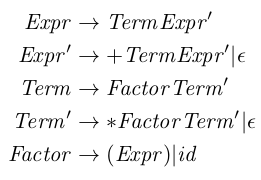

## A Simple Recursive-Descent Parser in Python

### Requirements

Python 3.10

### Recognized Grammar



### Running

You should run this in a Virtual Environment:

```
$ python3.10 -mvenv env/
$ source env/bin/activate
```

Then, before running, install the requirements:

```
$ pip install -r requirements.txt
```

`parser.py` will drive a demo.
